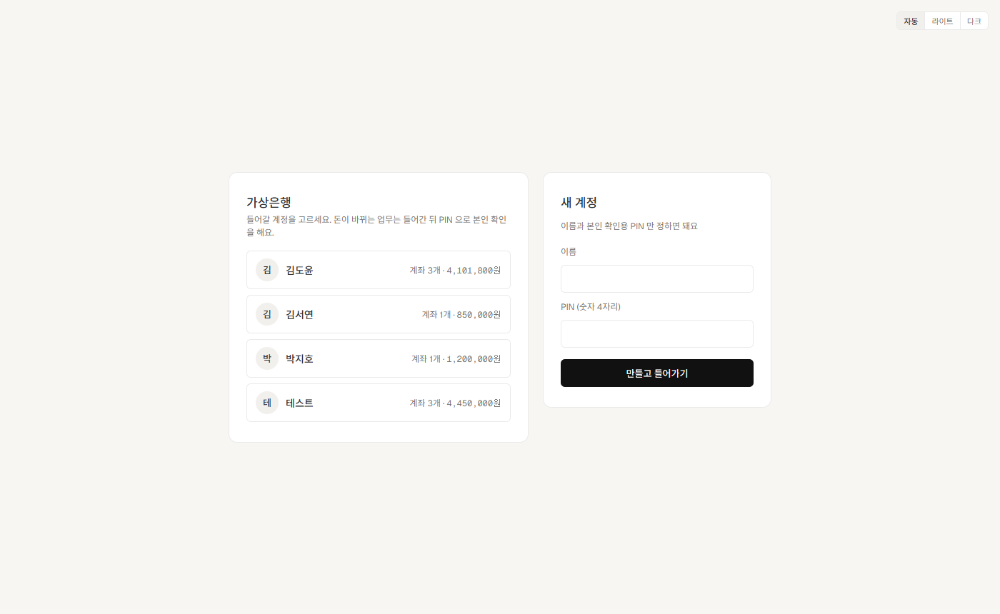
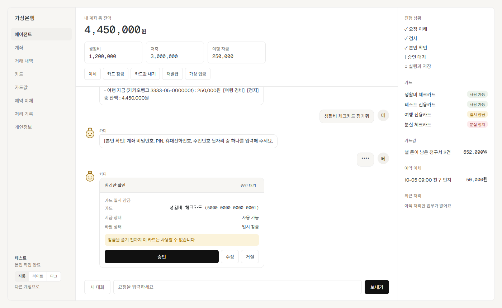
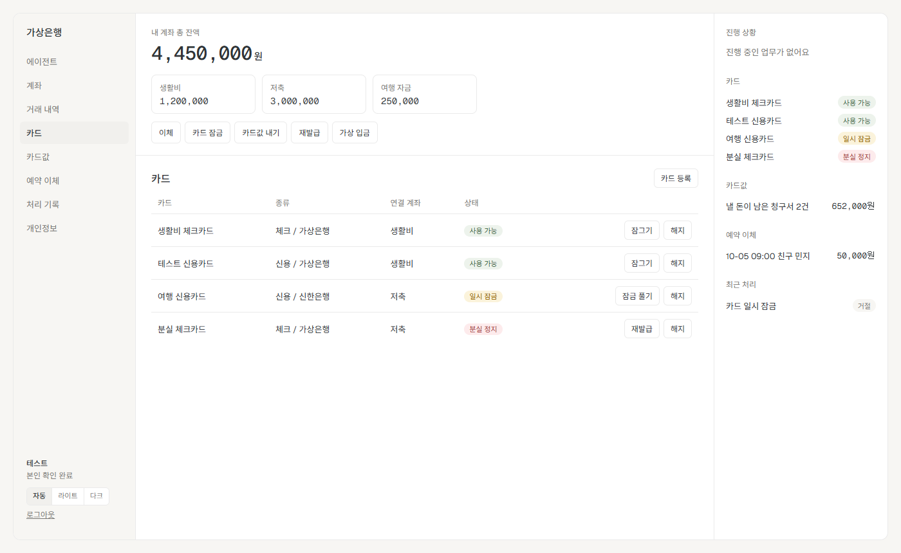
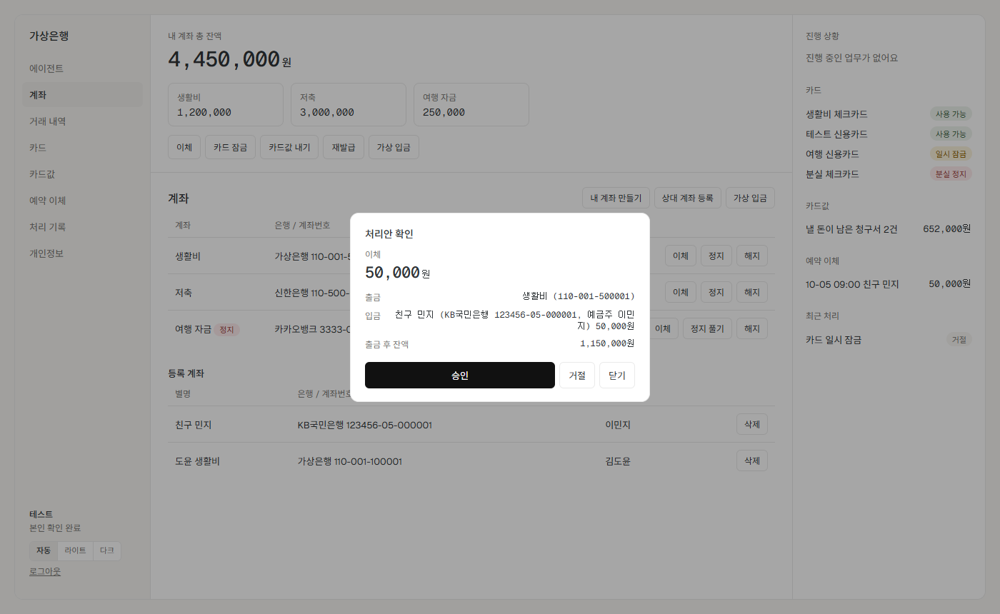

# 가상 금융 업무 에이전트 (Virtual Bank Agent)

말로 요청하면 계좌, 카드 업무를 처리해주는 LangGraph 기반 AI Agent다.
조회는 바로 답하고, 데이터가 바뀌는 업무는 **본인 확인 → 처리안 → 승인(Human in the Loop)** 을 거친 다음에만 저장한다.
금액, 잔액, 성공 여부는 LLM이 아니라 Python 함수가 계산한 값을 그대로 보여준다.

## 문서 (`docs/`)

설계는 **초안 → 설계 중 → 최종** 순서로 고쳐 갔다. 과제 제출물은 실행 코드 [src/](src/), 실행 안내(이 README 1~4장), 설계 초안, 최종 설계 자료, 회고다.
그림 옆 `원본`은 draw.io(`.drawio`) · Mermaid(`.mmd`) 파일이다.

### 1) 설계 초안 — `docs/설계 초안/` (제출물 : 설계 초안)

코딩 전에 직접 쓴 설계.

| 구분 | 파일 |
|---|---|
| 기획서 | [기획서_수기(초안).txt](<docs/설계 초안/기획서_수기(초안).txt>) : 설계 원칙, 전체 흐름, 계좌 · 카드 · 공통 기능 목록, 설계 순서 |
| 기능 그림 | [전체 기능 분류](<docs/설계 초안/기능/Virtual_Bank_Agent.drawio(기본카테고리).png>) ([원본](<docs/설계 초안/기능/Virtual_Bank_Agent.drawio>)) · [계좌](<docs/설계 초안/기능/계좌(필요_정보_추가).drawio.png>) · [카드](<docs/설계 초안/기능/카드(필요_정보_추가).drawio.png>) · [공통](<docs/설계 초안/기능/공통(필요_정보_추가).drawio.png>) (기능마다 필요한 정보) · [손으로 그린 초안 사진](<docs/설계 초안/기능/기능_설계_초안_사진.jpg>) |
| 기능별 세부 패턴 | 계좌 : [조회](<docs/설계 초안/각 기능 별 패턴/계좌/조회(세부_패턴).png>) ([원본](<docs/설계 초안/각 기능 별 패턴/계좌/조회(세부_패턴).drawio>)) · [이체](<docs/설계 초안/각 기능 별 패턴/계좌/이체(세부_패턴).png>) ([원본](<docs/설계 초안/각 기능 별 패턴/계좌/이체(세부_패턴).drawio>)) · [설정](<docs/설계 초안/각 기능 별 패턴/계좌/설정(세부_패턴).png>) ([원본](<docs/설계 초안/각 기능 별 패턴/계좌/설정(세부_패턴).drawio>))<br>카드 : [조회·결제](<docs/설계 초안/각 기능 별 패턴/카드/조회_결제(세부_패턴).png>) ([원본](<docs/설계 초안/각 기능 별 패턴/카드/조회_결제(세부_패턴).drawio>)) · [설정](<docs/설계 초안/각 기능 별 패턴/카드/설정(세부_패턴).png>) ([원본](<docs/설계 초안/각 기능 별 패턴/카드/설정(세부_패턴).drawio>))<br>공통 : [공통](<docs/설계 초안/각 기능 별 패턴/공통/공통(세부_패턴).png>) ([원본](<docs/설계 초안/각 기능 별 패턴/공통/공통(세부_패턴).drawio>)) |

### 2) 설계 중 — `docs/설계 중/`

초안을 검토하고 구현하면서 고친 설계.

| 구분 | 파일 |
|---|---|
| 기획서 | [기획서_수기(진행).txt](<docs/설계 중/기획서_수기(진행).txt>) : 초안 원본과 수정본을 나란히 두고 바꾼 이유를 적은 기록<br>[기획서_수기(정리).txt](<docs/설계 중/기획서_수기(정리).txt>) : 수정한 내용만 모은 정리본<br>[기획서(with_claude).md](<docs/기획서(with_claude).md>) : 구현 단계별 체크리스트와 나중에 보완할 점까지 넣은 설계 중 기획서 |
| 구조 | [전체 구조](<docs/설계 중/구조/전체_구조.svg>) ([원본](<docs/설계 중/구조/전체_구조.drawio>)) · [실행 흐름](<docs/설계 중/구조/실행_흐름.svg>) ([원본](<docs/설계 중/구조/실행_흐름.drawio>)) |
| 기능 | [계좌](<docs/설계 중/기능/계좌_기능.svg>) ([원본](<docs/설계 중/기능/계좌_기능.drawio>)) · [카드](<docs/설계 중/기능/카드_기능.svg>) ([원본](<docs/설계 중/기능/카드_기능.drawio>)) · [공통](<docs/설계 중/기능/공통_기능.svg>) ([원본](<docs/설계 중/기능/공통_기능.drawio>)) |
| 상태 전이 | [카드 상태](<docs/설계 중/상태/카드_상태전이.svg>) ([원본](<docs/설계 중/상태/카드_상태전이.drawio>)) · [재발급 상태](<docs/설계 중/상태/재발급_상태전이.svg>) ([원본](<docs/설계 중/상태/재발급_상태전이.drawio>)) |

### 3) 설계 최종 — `docs/설계 최종/` (제출물 : 최종 설계 자료, 회고)

실제 구현에 맞춰 고친 설계와 회고.

| 구분 | 파일 |
|---|---|
| 최종 설계 | [최종_설계.md](<docs/설계 최종/최종_설계.md>) : 전체 구조, 실행 흐름, 분기 조건, 그래프별 연결, 공통 노드, State와 데이터, **초안에서 바뀐 점과 이유**<br>[기획서_수기(최종).txt](<docs/설계 최종/기획서_수기(최종).txt>) : 초안 기획서를 구현 결과에 맞춰 고친 텍스트판 |
| 그래프 그림 | [실행 흐름](<docs/설계 최종/그래프/00_실행_흐름.png>) ([원본](<docs/설계 최종/그래프/00_실행_흐름.mmd>)) · [1단 supervisor](<docs/설계 최종/그래프/01_1단_supervisor.png>) ([원본](<docs/설계 최종/그래프/01_1단_supervisor.mmd>))<br>계좌 : [2단 계좌](<docs/설계 최종/그래프/02_2단_계좌.png>) ([원본](<docs/설계 최종/그래프/02_2단_계좌.mmd>)) · [3단 이체](<docs/설계 최종/그래프/03_3단_이체.png>) ([원본](<docs/설계 최종/그래프/03_3단_이체.mmd>)) · [3단 계좌 설정](<docs/설계 최종/그래프/04_3단_계좌설정.png>) ([원본](<docs/설계 최종/그래프/04_3단_계좌설정.mmd>))<br>카드 : [2단 카드](<docs/설계 최종/그래프/05_2단_카드.png>) ([원본](<docs/설계 최종/그래프/05_2단_카드.mmd>)) · [3단 카드 설정](<docs/설계 최종/그래프/06_3단_카드설정.png>) ([원본](<docs/설계 최종/그래프/06_3단_카드설정.mmd>)) · [3단 재발급](<docs/설계 최종/그래프/07_3단_재발급.png>) ([원본](<docs/설계 최종/그래프/07_3단_재발급.mmd>)) · [3단 카드 요금](<docs/설계 최종/그래프/08_3단_카드요금.png>) ([원본](<docs/설계 최종/그래프/08_3단_카드요금.mmd>)) |
| 회고 | [회고.md](<docs/설계 최종/회고.md>) ([텍스트판](<docs/설계 최종/회고.txt>)) : 배운 점, 어려웠던 점과 해결 과정, 남은 한계와 개선하고 싶은 점 |

### 4) 그 밖

| 파일 | 내용 |
|---|---|
| [financial-agent-mini-project.md](<docs/financial-agent-mini-project.md>) | 과제 안내문 (요구 사항, 제출물) |
| [정리_계획.md](<docs/정리_계획.md>) | 기능 구현이 끝난 뒤 코드 · 폴더를 정리한 단계별 계획 |
| [화면/](<docs/화면/>) | 웹 버전 화면 캡처 ([5장](#5-웹-버전-web)) |

---

## 1. 실행 방법

**준비할 것** : Python 3.13, [uv](https://docs.astral.sh/uv/), Gemini API 키

```bash
uv sync
```

`src/.env` 파일을 만들고 키를 넣는다.

```
GEMINI_API_KEY=발급받은_키
```

**실행**

```bash
uv run python src/main.py
```

```bash
uv run python src/main.py --debug
```

- `--debug`를 붙이면 실행 로그가 화면에도 나온다. 로그는 항상 `logs/날짜.log`에 남는다.
- `exit`나 `종료`를 치면 끝난다.
- 처음 켜면 `data/initial_data.json`(원본)을 `data/data.json`(작업본)으로 복사한다. 변경은 작업본에만 저장한다.
  처음 상태로 돌리고 싶으면 `data/data.json`을 지우고 다시 켜면 된다.
- **본인 확인** : 변경 업무랑 카드 번호 조회에서 한 번 물어본다. 한 번 하면 켜져 있는 동안 유지된다.
  가상 사용자(user-001)의 PIN `1234`를 넣으면 된다. (계좌 비밀번호, 휴대전화번호, 주민번호 뒷자리도 된다)

**확인 스크립트** : 기능마다 입력을 자동으로 넣고 결과를 출력하는 스크립트를 만들어 뒀다. 대부분 Gemini를 부르기 때문에 키가 필요하다.

```bash
uv run python 테스트/단계별/2-4_즉시이체_확인.py
```

- `테스트/단계별/` : 구현 단계별 확인 28개
- `테스트/보완/` : 구현 뒤에 보완한 기능이랑 버그 수정 확인 14개
- 스크립트는 시작할 때랑 끝날 때 `data.json`을 원본으로 되돌린다.

---

## 2. 구조

```
입력 → 멈춘 업무가 있나? ─ 있음 → 그 답으로 이어서 진행
                        └ 없음 → rewrite("그 카드" → 실제 이름) → 1단 supervisor
1단 supervisor : 계좌 / 카드 / 결과(처리 기록 조회) / 없음(안내)
2단 계좌 : 조회 · 거래내역 · 이체 · 설정          2단 카드 : 조회 · 설정 · 재발급 · 결제
3단 : 이체 / 계좌 설정 / 카드 설정 / 재발급 / 카드 요금
      값 뽑기(LLM) → 검사 → [질문 · 번호 고르기] → 본인 확인
      → 처리안 → 승인 대기 → 답 해석(승인/거절/수정/취소) → 실행 → 기록 → 저장 → 안내
```

- `src/agents/` : 노드와 그래프 (층별 폴더)
- `src/functions/` : 계산하는 함수
- `src/data_store.py` : 파일 읽기/저장
- `src/main.py` : 입력 받기, 스케줄러
- 자세한 그래프랑 분기 조건은 [최종 설계](docs/설계%20최종/최종_설계.md)에 있다.

---

## 3. 구현한 기능과 요청 예시

### 계좌

| 기능 | 요청 예시 | 참고 |
|---|---|---|
| 계좌 조회, 잔액 합계 | 내 계좌 목록과 잔액 보여줘 / 내 계좌에 총 얼마 있어? | |
| 거래 내역 | 이번 달 생활비 출금 내역 보여줘 / 5만원 이상 결제한 내역 찾아줘 / 9월 1일부터 10일까지 내역 | 기간, 계좌, 입출금, 금액을 섞어서 검색 가능 |
| 즉시 이체 | 생활비에서 저축으로 10만원 옮겨줘 | |
| 조건부 이체 | 생활비에 40만원 남기고 나머지를 저축해줘 | 실행 직전에 잔액이 바뀌면 다시 요청하라고 안내 |
| 나눠 이체 | 생활비에서 저축으로 20만원, 여행 자금으로 10만원 보내줘 | 하나라도 안 되면 전부 실행 안 함 |
| 예약 이체 | 내일 오전 9시에 생활비에서 저축으로 10만원 보내줘 / 예약 목록 보여줘 / 예약 취소해줘 | 30초마다 확인해서 실행 |
| 계좌 별명, 용도 | 여행 자금 계좌 이름을 휴가비로 바꿔줘 / 저축 용도를 비상금으로 바꿔줘 | 1~20자, 별명은 겹치면 안 됨 |
| 상대 계좌 등록 | 미래은행 210-11-223344 이영희 계좌 등록해줘 / 등록 계좌 보여줘 / 친구 민수 계좌 삭제해줘 | 등록한 계좌로 이체도 가능 |

### 카드

| 기능 | 요청 예시 | 참고 |
|---|---|---|
| 카드 조회 | 내 카드 목록과 상태 보여줘 / 가상은행이랑 미래은행 카드 보여줘 / 가상은행 말고 다른 은행 카드는? | 은행별로 나눠서 보여줌 |
| 카드 상세 | 신용카드 결제 계좌가 뭐야? / 멤버십 보여줘 / 이번 달 카드 이용 내역 / 카드 번호 알려줘 | 카드 번호는 본인 확인 뒤에만 |
| 분실 정지, 잠금, 해제 | 생활비 카드 잃어버렸어. 정지해줘 / 생활비 카드 잠깐 잠가줘 / 생활비 카드 잠금 풀어줘 | 분실 정지는 해제 안 됨 |
| 해지, 별칭, 비밀번호, 등록 | 여행 카드 해지해줘 / 생활비 카드 별칭을 장보기로 바꿔줘 / 카드 비밀번호 바꿔줘 / 미래은행 체크카드 1234-5678-1234-5678 생활비 계좌로 등록해줘 | 새 비밀번호는 화면에 안 보이게 입력 |
| 재발급 신청, 조회 | 잃어버린 생활비 카드를 집으로 재발급받고 싶어 / 카드 재발급 신청 상태 알려줘 | 분실 정지 카드만 |
| 재발급 수정, 취소 | 재발급 카드 배송지를 회사로 바꿔줘 / 재발급 신청 취소해줘 | 접수 상태일 때만 |
| 정지 후 재발급 | 생활비 카드를 잃어버렸어. 정지하고 집으로 재발급해줘 | 승인을 2번 받음. 두 번째를 거절해도 정지는 유지 |
| 카드 요금 | 카드값 얼마야? / 8월 생활비 신용카드 명세서 보여줘 | 신용카드만 |
| 카드값 결제 | 8월 생활비 신용카드 값 내줘 / 10만원만 내줘 / 3개월로 나눠 내줘 / 카드값 전부 일괄로 내줘 | 전체, 부분, 분할(남은 회차 자동 납부), 일괄 |

### 공통

| 기능 | 요청 예시 |
|---|---|
| 승인, 거절 | 처리안에 "승인" / "응, 진행해" / "거절" / "취소할게" |
| 승인 전에 수정 | 처리안에 "아니, 5만원만" / "입금은 여행 자금으로" → 처리안을 다시 보여줌 |
| 부족한 정보 질문, 후보 고르기 | "저축으로 10만원 옮겨줘" → 어느 계좌에서 보낼지 물어봄 / 이름이 여러 개면 번호로 고르기 |
| 결과 조회 | 아까 이체 됐어? / 어제 여행 카드 잠근 거 됐어? / 오늘 처리한 거 다 보여줘 |
| 앞에서 말한 것 가리키기 | (여행 카드 조회 뒤) 그 카드 잠가줘 → "여행 카드 잠가줘"로 바꿔서 처리 |
| 재시작 복구 | 승인 기다리는 중에 종료 → 다시 켜면 멈춘 업무를 알려주고 처음부터 다시 할지 물어봄 |
| 부족하거나 안 되는 요청 | 이체해줘 / 생활비에서 저축으로 -1만원 옮겨줘 / 오늘 날씨 어때 |

---

## 4. 동작 확인 결과

확인 스크립트 42개를 전부 돌려서 나온 실제 결과다. (2026-09-28, 코드 정리 끝나고 전체 실행 : 42개 모두 오류 없이 끝남)

### 4.1 구현한 기능

| 기능 | 입력 → 결과 | 스크립트 |
|---|---|---|
| 1단 분류 | 계좌 3개, 카드 3개, 업무 아닌 것 2개 요청 → **8개 다 맞음** | 단계별/1-2 |
| 즉시 이체 | "생활비에서 저축으로 10만원" → 처리안(출금 후 잔액 1,331,800원) → 승인 → 이체. 거래 내역에 출금 `tx-021`, 입금 `tx-022`, 처리 기록 `req-0001 이체 완료` | 단계별/2-4 |
| 거절 | 처리안에 "거절" → "이체 요청을 진행하지 않았습니다. 바뀐 것은 없습니다." 잔액 그대로, 기록 `req-0002 이체 거절` | 단계별/2-3 |
| 조건부 이체 | "생활비에 40만원 남기고 나머지 저축" → 1,031,800원 이체, 생활비 잔액 400,000원 | 단계별/3-3 |
| 나눠 이체 + 수정 | 저축 20만, 여행 자금 10만 → "저축은 5만원으로 해줘"로 수정 → 처리안 다시(총 150,000원) → 승인 → 두 곳 이체 | 단계별/3-4 |
| 예약 이체 | 예약 → 목록에 `[예약]` → 시간이 지난 뒤 켜면 `[예약 이체 완료]` → 취소하면 `sch-002 [취소]` | 단계별/3-8 |
| 계좌 등록, 삭제 | 2건 등록(`reg-003`, `reg-004`), 같은 계좌 또 등록하면 거절, 삭제 | 단계별/3-7 |
| 카드 설정 | 별칭 변경, 비밀번호 변경(로그에 새 비밀번호 안 남음), 해지, 등록(`card-009`) | 단계별/4-4 |
| 재발급 | 분실 정지 카드 → 회사로 신청 `app-003 [접수]` → "재발급 어떻게 됐어?"에 처리 기록으로 답 | 단계별/4-5 |
| 정지 후 재발급 | 분실 신고 처리안 → 승인 1 → 재발급 처리안("앞 단계 : 분실 신고 완료") → 승인 2 | 단계별/4-7 |
| 카드 조회 (은행별) | "가상은행 카드" → 6장, 분실 정지 카드는 `(사용 불가)` / "우리은행 말고 다른 은행은?" → 우리은행 빼고 은행별로 | 보완/은행별카드조회, 다른은행카드 |
| 요금 조회 | "카드값 얼마 내야 돼?" → 낼 돈이 남은 청구서 4건과 합계 | 단계별/4-8 |
| 반송 | 일부러 카드 요청을 계좌로 잘못 보냄 → 한 번 반송 → 카드로 처리 / 두 번째도 아니면 안내 | 단계별/5-3 |
| 카드값 결제 | 전체 결제 320,000원 → `paid`, 부분 결제 100,000원 → `partial` | 단계별/4-9 |
| 분할, 일괄 | 3개월 분할 1회차 150,668원 / 일괄 4건 → 완료 3, 실패 1(잔액 부족) | 단계별/4-10 |
| 분할 남은 회차 | 납부일이 지나면 2/3회, 3/3회 자동 납부 → `분할 끝` | 보완/분할자동납부 |
| 스케줄러 | 입력 없이 기다리는 동안 예약 이체, 분할 회차 실행 → 다음 입력 때 결과 보여줌 | 보완/실시간스케줄러 |
| 결과 조회 | "아까 이체 됐어?" → 처리 기록 `req-0001 이체 [완료]` / "오늘 처리한 거 다 보여줘" → 2건 | 단계별/5-1 |
| 대화 기억 | "그 카드 잠가줘" → "여행 카드 잠가줘" / "거기서 저축으로 5만원" → "여행 자금에서 저축으로 5만원" | 보완/대화기억 |

### 4.2 직접 고른 실패 상황

| 실패 상황 | 입력 → 결과 | 스크립트 |
|---|---|---|
| 음수 이체 | "생활비에서 저축으로 -1만원" → "이체 금액은 0원보다 커야 합니다." (처리안까지 안 감) | 단계별/2-4 |
| 잔액 부족 | 1억원 이체 → "잔액이 부족합니다. (잔액 1,331,800원 / 보낼 금액 100,000,000원)" | 단계별/2-4 |
| 승인 뒤에 잔액이 바뀜 | 처리안을 보여준 뒤 잔액을 1,000원으로 바꾸고 승인 → 실행 직전에 다시 검사해서 "잔액이 부족합니다"로 이체 안 함 | 단계별/2-4 |
| 남기면 보낼 돈이 없음 | 잔액 40만원인데 "500만원 남기고 나머지" → "잔액이 400,000원이라 5,000,000원을 남기면 보낼 금액이 없습니다." | 단계별/3-3 |
| 저장 실패 | `data.json`을 읽기 전용으로 바꾸고 승인 → 3번 시도 후 "저장에 실패해 처리하지 못했습니다. 바뀐 것은 없습니다." 처리 기록도 안 늘어남 (저장 실패 경우 35가지 전부 통과) | 단계별/2-3, 0-3 |
| 본인 확인 틀림 | 틀리면 "일치하지 않습니다. (1/3)" 다시 물어봄 → 3번 틀리면 "본인 확인에 3번 실패했습니다. 처음부터 다시 요청해 주세요." | 단계별/3-5 |
| 지난 시간으로 예약 | "어제 오전 9시에 …" → "예약 시각이 이미 지났습니다." | 단계별/3-8 |
| 예약 실행 때 잔액 부족 | 꺼져 있는 동안 1억원 예약 시간이 지남 → 켤 때 `[예약 이체 실패] … 잔액이 부족합니다`. "이체 됐어?"에 `예약 이체 실행 [실패]`로 답 | 단계별/3-8, 보완/예약실행기록 |
| 제작중인 재발급 수정 | 제작중 신청의 배송지 수정 → "제작중 상태라 배송지를 수정할 수 없습니다. 접수 상태일 때만 됩니다." | 단계별/4-6 |
| 분실 정지 카드 잠금 | 분실 정지 카드 "잠가줘" → "분실 정지된 카드는 잠그거나 해제할 수 없습니다. 재발급을 신청해 주세요." | 단계별/4-3 |
| 이미 냄, 더 많이 냄 | 다 낸 청구서 → "이미 납부 완료된 청구서입니다." / 45,000원 남았는데 더 많이 → "남은 금액(45,000원)보다 많이 낼 수 없습니다." | 단계별/4-9 |
| 일괄 결제 중 한 건 실패 | 4건 중 1건 잔액 부족 → 그 건만 실패, 나머지 3건은 완료되고 저장 유지 | 단계별/4-10 |
| 승인 기다리는 중 다른 요청 | 처리안에 "내 계좌 잔액 보여줘" → "진행 중이던 요청을 멈췄습니다. 새 요청을 다시 입력해 주세요." | 보완/버그수정 |
| 질문 중 취소, 다른 요청 | 질문에 "취소할게" → 이체 취소 / 본인 확인에 "그만할래" → 취소 / 다른 요청 → 지금 업무 멈춤 | 보완/버그수정 |
| 번호 고르기에 번호 말고 다른 말 | → "현재 'OO' 업무 중입니다. 번호로 골라 주세요. 다른 요청은 '취소' 후 다시 입력해 주세요."를 붙여서 다시 물어봄 | 보완/번호고르기안내 |
| 재시작 복구 | 승인 기다리는 중 종료 → 다시 켜면 "[진행 중이던 업무] … 처음부터 다시 진행할까요?" → "예"면 처음부터(승인도 다시), "아니오"면 지움. 자동으로 실행 안 함 | 단계별/5-2 |
| LLM이 날짜 형식을 틀림 | 가짜 LLM으로 형식 오류를 냄 → 에러 대신 "날짜를 알아듣지 못했습니다. (예: …)" | 보완/버그수정 |

---

## 5. 웹 버전 (`web/`)

위 1~4장은 터미널 버전(`src/`)이다. 과제 제출본이라 그대로 두고, 같은 에이전트를 웹 화면으로 쓰는 버전을 `web/`에 따로 만들었다.
에이전트 코드는 `src/`를 복사한 `web/bank/`를 쓰고, 데이터도 웹 전용 `web/data/`를 쓴다.

**구조** : 서버 두 개로 나눴다.

| | 하는 일 | 주소 |
|---|---|---|
| FastAPI (`web/server.py`) | 에이전트 실행, 버튼 업무, 계정 고르기, 스케줄러. `/api` 만 있다 | http://127.0.0.1:8000 |
| Next.js (`web/frontend/`) | 화면. `/api/...` 요청을 FastAPI 로 넘긴다 | http://localhost:3000 |

**실행** : 1장처럼 `uv sync`, `src/.env` 키를 먼저 준비한다. 웹 버전도 같은 키를 쓴다. Node.js가 필요하다.

```bash
npm --prefix web/frontend install
```

```bash
uv run python web/server.py
```

```bash
npm --prefix web/frontend run dev
```

- 두 서버를 켜고 브라우저에서 http://localhost:3000 을 연다.
- 첫 화면에서 계정을 눌러 바로 들어간다. 가상 은행이라 로그인 비밀번호는 없고, 돈이나 상태가 바뀌는 업무만 본인 확인(PIN 등)을 한다.
  새 계정은 옆 칸에서 이름과 PIN만 정하면 된다.
- 시험용 계정 `테스트` : 계좌 3개(하나는 정지), 등록 계좌 2개, 카드 4장(잠금, 분실 정지 포함), 낼 카드값 2건, 예약 이체 1건이 들어 있다. 본인 확인 PIN은 `1234`다.
- 처음 상태로 돌리려면 `web/data/data.json`을 지우고 FastAPI를 다시 켠다.

**터미널 버전에 더한 것**

- 계정 고르기, 새 계정 만들기, 여러 사람 (사람마다 데이터, 에이전트 대화, 재시작 복구, 알림이 따로)
- 대화 옆 캐릭터 : 1단 supervisor가 고른 분야마다 다른 캐릭터가 답한다. 뱅키(안내), 머니(계좌), 카디(카드), 로기(처리 결과)
- 처리안 카드 : 승인 / 수정 / 거절 버튼. 본인 확인을 물을 때는 입력칸이 비밀번호 칸이 되고 대화에는 `****`로만 남는다
- 진행 상황 : 바꾸는 업무가 멈춰 있으면 오른쪽에 `요청 이해 → 검사 → 본인 확인 → 승인 대기 → 실행과 저장` 중 어디인지 보여준다
- 메뉴 화면 : 계좌, 거래 내역, 카드, 카드값, 예약 이체, 처리 기록 (LLM 없이 데이터를 바로 읽음)
- 버튼 업무 : 이체·예약 이체, 카드 잠금·해제·해지·재발급, 카드값 내기, 계좌 만들기·정지·해지, 상대 계좌 등록, 카드 등록, 가상 입금, 가상 카드값.
  에이전트와 같은 순서(검사 → 처리안 → 본인 확인 → 다시 검사 → 실행 → 기록 → 저장)를 LLM 없이 한다
- 가상 입금·가상 카드값 : 시험용으로 잔액을 넣거나, 신용카드에 이번 달 카드값을 만들어 직접 내 볼 수 있다
- 개인정보 : 이름, 휴대전화번호, PIN 바꾸기 (지금 PIN 확인 필요)
- 다크 모드 : 자동 / 라이트 / 다크

**화면**

첫 화면 : 계정을 골라 들어가거나, 이름과 PIN으로 새 계정을 만든다.



대화 : 머니(계좌)가 계좌 목록을 답하고, 카드 잠금은 카디가 본인 확인 → 처리안 카드로 받는다. 오른쪽 진행 상황은 `승인 대기`.



메뉴 화면 (카드) : 카드 상태마다 할 수 있는 버튼만 나온다.



버튼 업무 (이체) : 입력 → 서버 검사 → 처리안 확인. 승인하면 본인 확인부터 에이전트와 같은 순서로 처리한다.



가상 카드값 : 신용카드를 골라 이번 달 청구서를 만들고, 카드값 화면의 `전체 내기`로 낸다.


개인정보 :


다크 모드 :


