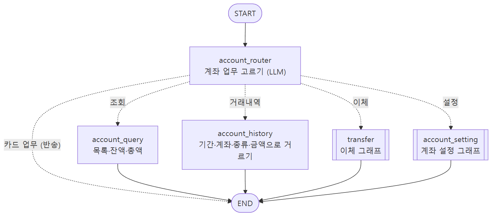
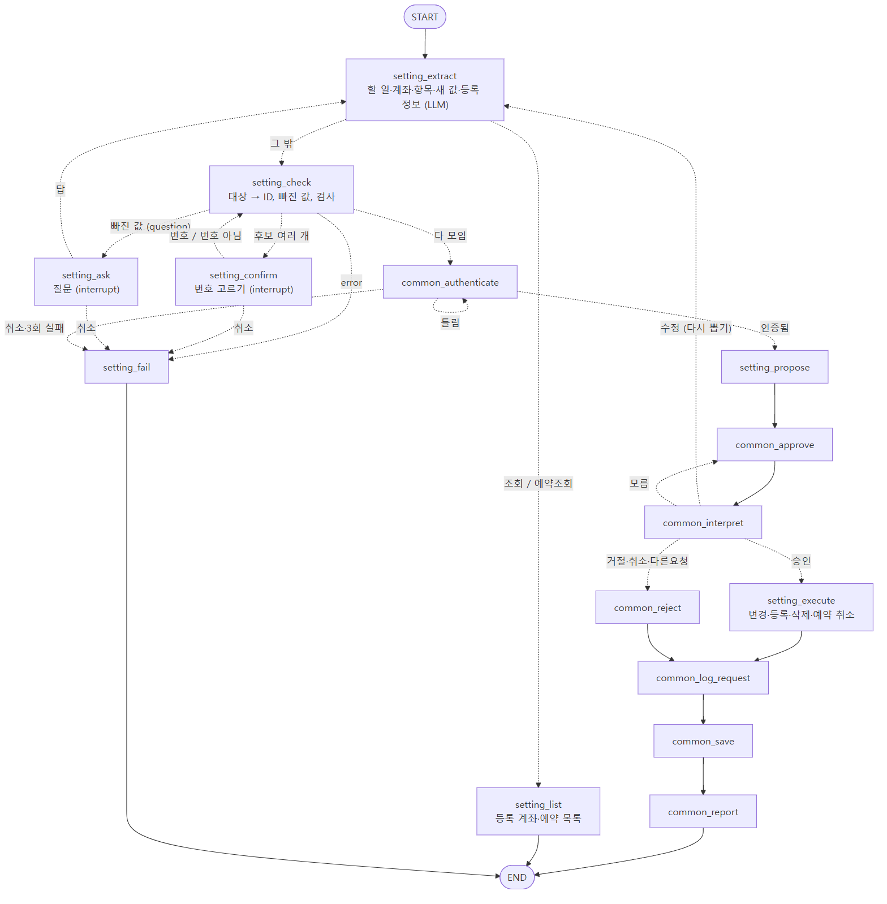

# 가상 금융 업무 에이전트 — 최종 설계

구현을 다 끝내고 실제 코드에 맞춰 정리한 설계다.
그래프 그림은 코드에서 뽑은 연결을 기준으로 그렸고, 화살표에 분기 조건을 적었다.

| 문서 | 내용 |
|---|---|
| [설계 초안/](../설계%20초안/) | 코딩 전에 직접 쓴 초안과 손그림 |
| [설계 중/](../설계%20중/) · [기획서.md](../기획서.md) | 초안을 검토하고 구현하면서 계속 고친 설계 |
| **이 문서** | 최종 구조, 흐름, 분기 조건, 바뀐 점 |
| [기획서_수기(최종).txt](기획서_수기(최종).txt) | 초안과 같은 형식으로 쓴 최종본 (agent별 state, 노드, 기능) |
| [그래프/](그래프/) | 그래프 그림 (`.png` 사진, `.mmd` 원본) |
| [회고.md](회고.md) | 배운 점, 어려웠던 점과 해결 과정, 남은 한계 |

---

## 1. 전체 구조

```
src/
├── main.py         입력 받기, 멈춘 업무 확인, 대화 기억, 재시작 복구, 30초 스케줄러
├── state.py        모든 그래프가 같이 쓰는 state
├── data_store.py   data.json 읽기/저장
├── logger.py       실행 로그
├── functions/      계산만 하는 함수 (계좌, 이체, 카드, 재발급, 결제, 공통)
└── agents/         노드와 그래프
    ├── supervisor/   1단
    ├── account/      2단 계좌 → transfer(이체), setting(계좌 설정) 3단
    ├── card/         2단 카드 → setting(카드 설정), reissue(재발급), billing(결제) 3단
    ├── result/       결과 조회 ("아까 이체 됐어?")
    └── common/       공통 노드
```

- 3단 그래프를 2단 그래프의 노드로, 2단 그래프를 1단 그래프의 노드로 넣었다.
- 노드는 흐름만 정하고, 계산은 `functions/`가 한다. LLM은 말에서 값을 뽑고 분류만 한다.
- 저장은 `common_save` 한 곳에서만 한다.

| 단계 | 고르는 것 | 선택지 |
|---|---|---|
| 1단 supervisor | 분야 | 계좌 / 카드 / 결과 / 없음 |
| 2단 account_router | 계좌 업무 | 조회 / 거래내역 / 이체 / 설정 / (카드 업무면 반송) |
| 2단 card_router | 카드 업무 | 조회 / 설정 / 재발급 / 결제 / (계좌 업무면 반송) |
| 3단 extract | 할 일과 필요한 값 | 업무마다 다름 (이체면 금액, 남길 금액, 예약 시각 등) |

---

## 2. 실행 흐름


1. 입력이 들어오면 먼저 멈춰 있는 업무(승인, 질문 대기)가 있는지 본다.
2. 있으면 입력을 그 답으로 넘겨서 멈춘 곳부터 이어간다.
3. 없으면 이전 업무 값을 비우고 새 요청으로 시작한다.
4. 그래프가 멈추면 질문이나 처리안을 보여주고, 진행 중인 업무를 `data.json`의 `pending`에 적어둔다.
5. 끝나면 답을 보여주고 최근 대화에 남긴다. 최근 대화는 5턴까지 남긴다.

켜져 있는 동안은 스케줄러가 30초마다 예약 이체와 분할 결제를 확인한다. 결과는 큐에 모아뒀다가 다음 입력 때 보여준다.

### 변경 업무 공통 흐름

```
값 뽑기(extract) → 검사(check)
  ├ 안 됨        → 이유 안내하고 끝(fail)
  ├ 후보 여러 개  → 번호로 고르기 → 다시 검사
  ├ 빠진 값      → 질문 → 다시 값 뽑기
  └ 다 모임      → 본인 확인 → 처리안 → 승인 대기 → 답 해석
                    ├ 승인   → 실행 직전 재검사 → 실행
                    ├ 거절·취소·다른 요청 → 거절 기록
                    ├ 수정   → 다시 검사 → 새 처리안
                    └ 모름   → 다시 묻기
                  → 처리 기록 → 저장(3번까지) → 결과 안내
```

조회는 값 뽑기 다음에 바로 답하고 끝난다.

### 분기 조건 한눈에 보기

| 분기 | 언제 |
|---|---|
| 조회 | 읽기만 하는 요청 (조회, 거래 내역, 목록, 요금 조회, 명세서) → 인증·승인 없이 바로 답 |
| 변경 | 데이터가 바뀌는 요청 → 본인 확인, 처리안, 승인을 거침 |
| 승인 | 답 해석이 "승인" → 실행 |
| 거절 | "거절", "취소", "다른 요청" → 저장하지 않고 거절로만 기록 |
| 실패 | 검사에서 안 됨(잔액 부족, 없는 계좌 등) / 질문·본인 확인 중 취소 / 본인 확인 3번 틀림 / 실행 직전 재검사 실패 / 저장 3번 실패 |

---

## 3. 그래프별 연결

### 1단 supervisor


- `rewrite`가 최근 대화를 보고 "그 카드" 같은 말을 실제 이름으로 바꾼다.
- `supervisor`가 계좌 / 카드 / 결과 / 없음으로 나눈다.
- 2단이 "내 업무가 아니다"라고 하면 반대쪽으로 한 번 넘긴다(`bounce`). 두 번째도 아니면 안내하고 끝낸다.

### 2단 계좌



- 조회와 거래 내역은 노드 하나로 바로 답한다.
- 이체와 설정은 3단 그래프로 보낸다.

### 3단 이체


- 이체 종류를 따로 분류하지 않고 뽑은 값으로 정한다. 남길 금액이 있으면 조건부, 목록이 2개 이상이면 나눠, 예약 시각이 있으면 예약이다.
- 안 되는 경우: 계좌를 못 찾음, 보내는 계좌와 받는 계좌가 같음, 금액이 0 이하, 잔액 부족, 예약 시각이 지남, 조건부·나눠 이체를 예약하려고 함.
- 나눠 이체는 하나라도 안 되면 전부 실행하지 않는다.
- 승인 뒤 실행 직전에 잔액을 다시 본다.

### 3단 계좌 설정



- 할 일: 별명·용도 변경, 상대 계좌 등록·삭제·조회, 예약 이체 조회·취소.
- 별명은 내 다른 계좌와 겹치면 안 된다. 등록할 때 빠진 정보가 있으면 그것만 다시 묻는다.

### 2단 카드


- 조회는 2단 안에서 끝낸다. 카드 번호 조회만 본인 확인을 한다.
- 분실 신고 뒤에 재발급도 원하면 재발급 그래프로 이어서 보낸다.

### 3단 카드 설정


- 할 일: 분실 신고, 잠금, 잠금 해제, 해지, 별칭 변경, 비밀번호 변경, 카드 등록.
- 카드 상태: 사용 가능 ↔ 잠금, 둘 다 → 분실 정지 / 해지. 분실 정지는 해지만 가능하다.
- 카드 이름이 똑같은 걸 먼저 찾고, 여러 장이면 번호로 고르게 한다.

### 3단 재발급


- 분실 정지된 카드만 신청할 수 있다.
- 신청 상태: 접수 → 제작중 → 배송중. 접수일 때만 배송지 수정과 취소가 된다.
- "분실했으니 정지하고 재발급해줘"는 승인을 두 번 따로 받는다. 재발급을 거절해도 분실 정지는 그대로다.

### 3단 카드 요금


- 할 일: 요금 조회, 명세서 조회, 결제(전체 / 부분 / 분할 / 일괄).
- 분할은 첫 회차를 바로 내고, 나머지는 한 달마다 스케줄러가 낸다. 분할 중에는 남은 금액을 한 번에 다 낼 때만 결제할 수 있다.
- 일괄 결제는 한 건씩 내고 바로 저장한다. 중간에 실패해도 앞에 낸 건은 남는다.

---

## 4. 공통 노드

| 노드 | 하는 일 |
|---|---|
| `common_pending_check` | 멈춰 있는 업무가 있는지 확인 (main.py가 입력마다 부름) |
| `common_pick_card` | 카드가 여러 장이면 번호로 고르기 |
| `common_authenticate` | 본인 확인. 한 번 하면 계속 유지, 3번 틀리면 끝 |
| `common_approve` | 처리안을 보여주고 답을 기다림 (interrupt만) |
| `common_interpret` | 답을 승인 / 거절 / 취소 / 수정 / 다른 요청 / 모름으로 해석 |
| `common_reject` | 거절 안내 |
| `common_log_request` | 처리 기록 남기기 |
| `common_save` | 저장. 실패하면 3번까지 다시 |
| `common_report` | 저장이 실패했으면 실패로 안내 |

---

## 5. State와 데이터

- 새 요청이 오면 이전 업무 값을 전부 비운다. 본인 확인과 직전 이체만 남긴다.
- 체크포인터는 메모리라 끄면 사라진다. 그래서 오래 남아야 하는 건 `data.json`에 둔다.
  - `requests`: 처리 기록. 결과 조회("아까 이체 됐어?")는 여기서 찾는다.
  - `pending`: 진행 중인 업무. 다시 켜면 알려주고 처음부터 다시 진행한다 (승인도 다시).
- `initial_data.json`은 읽기만 하고, 변경은 `data.json`에만 저장한다. 임시 파일에 다 쓰고 바꿔 끼우는 방식이다.
- 비밀번호, PIN, 주민번호 뒷자리는 해시로 저장한다.

---

## 6. 초안에서 바뀐 점

### 구현 전에 바뀐 것

| 바꾼 것 | 이유 |
|---|---|
| 승인 기준을 "민감정보, 돈"에서 "데이터가 바뀌는지"로 | 분실 정지는 돈이 안 움직여도 승인이 필요했다 |
| 맨 앞에 멈춘 업무 확인 추가 | 없으면 "응, 진행해"가 새 요청으로 분류된다 |
| 승인 노드를 처리안 / 승인 / 실행으로 분리 | interrupt 뒤 다시 시작하면 노드를 처음부터 실행해서 저장이 두 번 될 수 있다 |
| subgraph를 tool이 아니라 노드로 | tool로 감싸면 다시 실행되는 범위가 커진다 |
| 부족한 정보 확인을 2단 → 3단 | 2단에서는 뭐가 부족한지 알 수 없다 |
| 반송 경로, 되돌아가는 흐름(질문, 수정, 거절) 추가 | 성공하는 경우만 있고 잘못됐을 때 돌아갈 길이 없었다 |
| 카드 agent 2개 → 4개 | 한 agent에 기능이 너무 많았다 |
| 마지막 "LLM 최종 검토" 삭제 | LLM이 금액을 다시 쓰면 틀릴 수 있다 |

### 구현하면서 바뀐 것

| 바꾼 것 | 이유 |
|---|---|
| 공통 노드 17개 → 8개 | 업무마다 물어보는 게 달라서, 모두 똑같이 거치는 것만 남겼다 |
| 이체 유형 분류 노드 삭제 | "40만원 남기고 내일 보내줘"처럼 여러 유형이 같이 온다 |
| 1단에 결과 / 없음 추가, 앞에 rewrite | 결과 조회는 계좌도 카드도 아니고, "그 카드"는 분류 전에 풀어야 했다 |
| 조회를 3단 agent 대신 2단 노드로 | 조회는 승인, 저장이 없어서 노드 하나로 충분했다 |
| 예약 이체에 30초 스케줄러, 큐, 잠금 | 입력이 없으면 예약이 실행되지 않았다 |
| 조건부, 나눠 이체는 예약 불가 | 조건부는 실행할 때 금액이 바뀔 수 있다 |
| 비밀번호를 해시로 저장 | 파일에 그대로 들어 있었다 |
| 재시작 복구는 처음부터 다시 | 꺼진 동안 잔액이나 상태가 바뀌었을 수 있다 |
| 카드 이름은 똑같은 이름 먼저 | "생활비 카드"에 "생활비 신용카드"까지 걸렸다 |
| 분할 결제 남은 회차 자동 납부 | 회차만 만들고 내는 기능이 없었다 |
| 등록한 계좌로도 이체 | 등록만 되고 이체는 못 했다 |
| 폴더 나누기 (agents/ 층별, functions/ 업무별) | 파일 하나가 700줄까지 길어졌다 |
| langsmith 빼고 파일 로그만 | 로그로도 충분히 확인할 수 있었다 |

### 하지 않은 것

- 재시작할 때 첫 문장 뒤에 답한 것까지 복원하기: 첫 문장으로 처음부터 다시 한다.
- 카드로 가맹점 결제하기: 범위 밖이라 안내만 한다.
- 장기 기억(자주 쓰는 계좌, 배송지): 대화 기억은 켜져 있는 동안만 남는다.
- 비슷한 분기 함수 합치기: 합치면 오히려 읽기 어려워진다.
- 긴 함수 나누기: 기능을 더 붙일 때 나누기로 했다.
