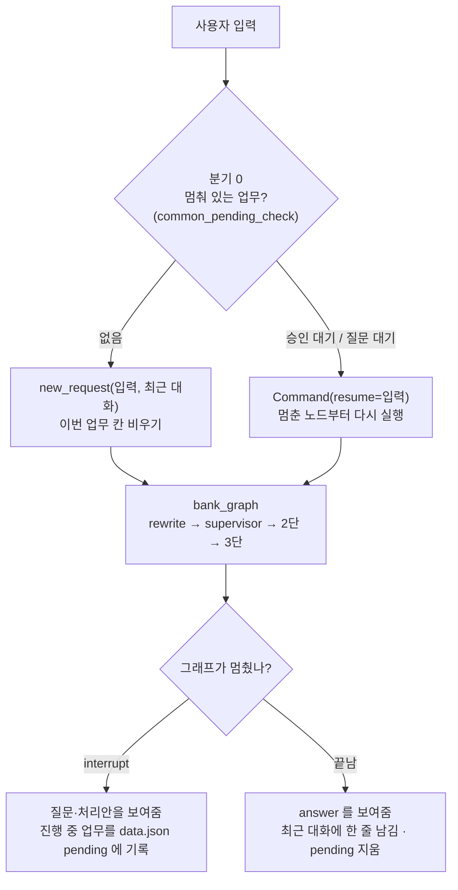
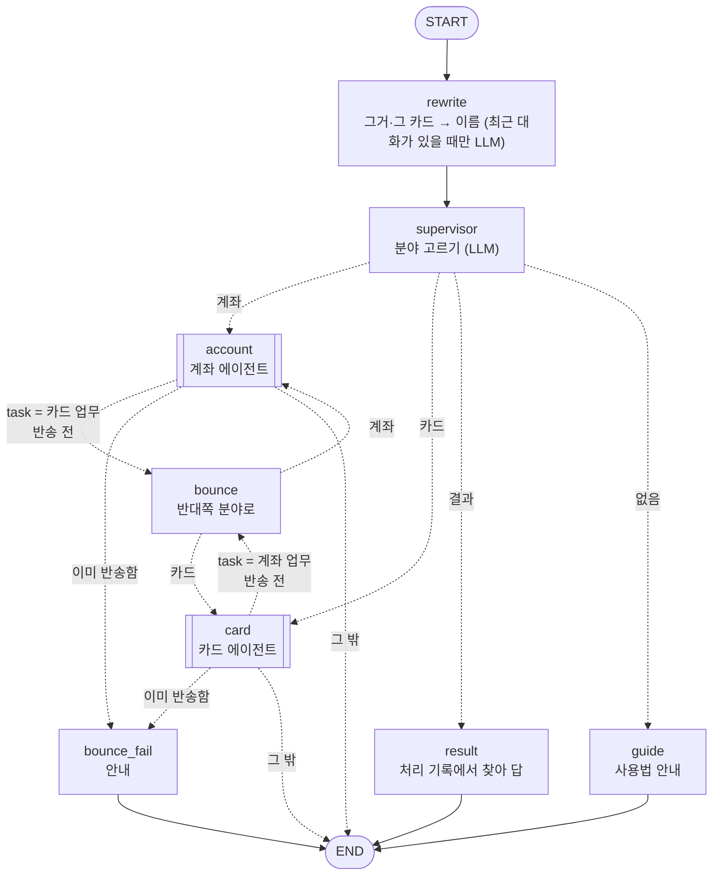
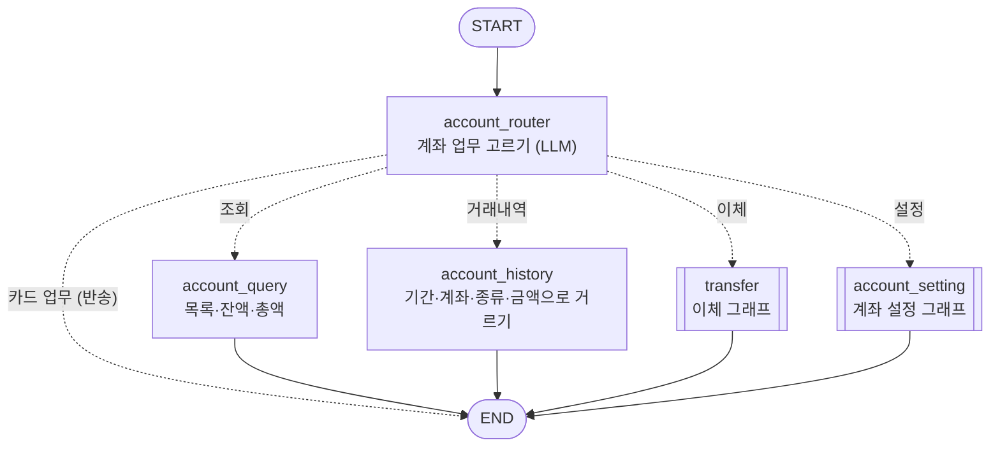
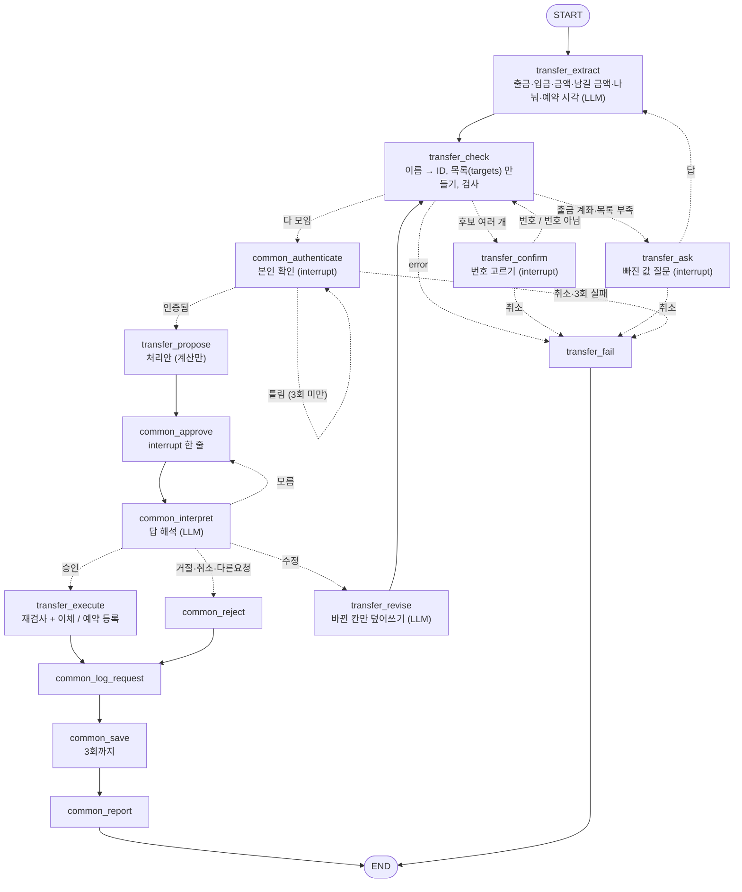
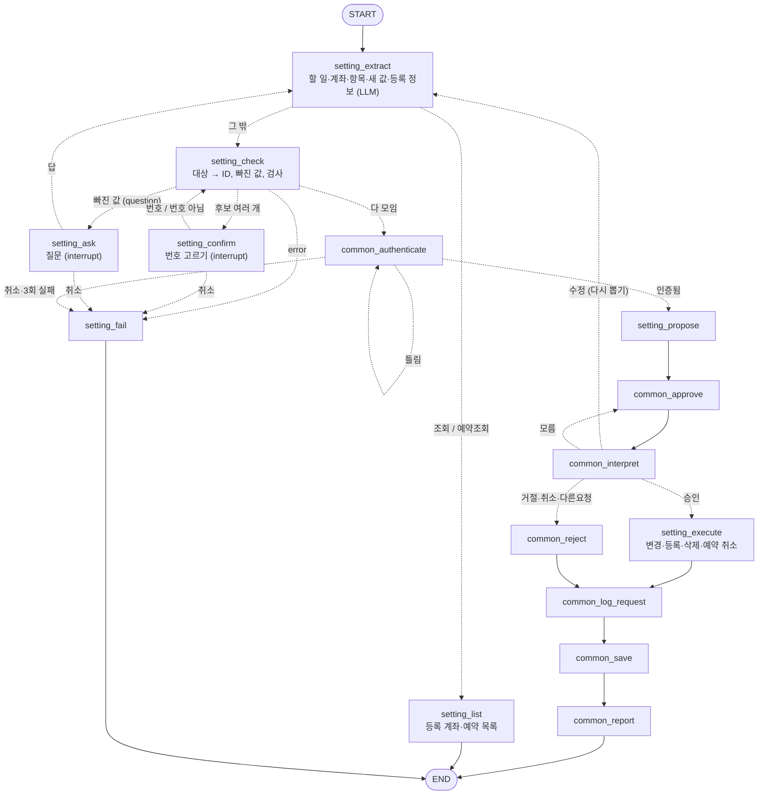
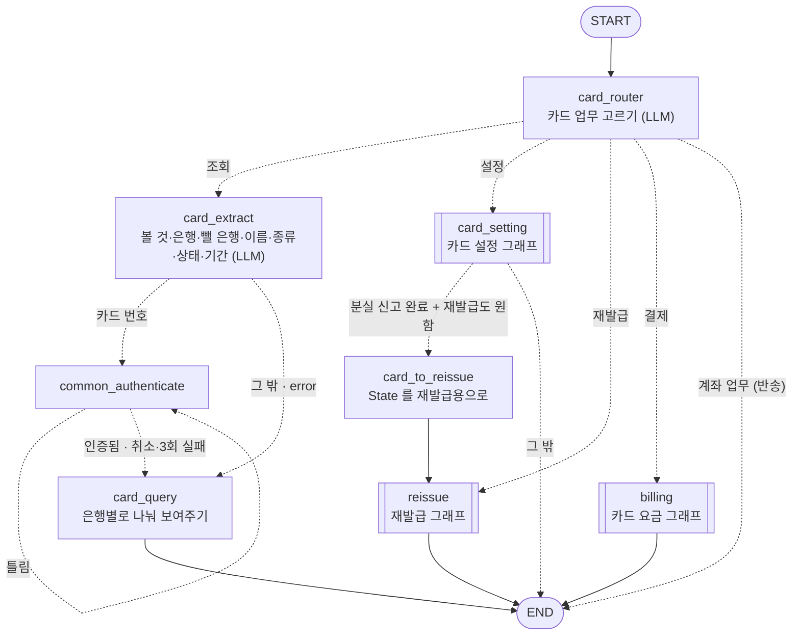
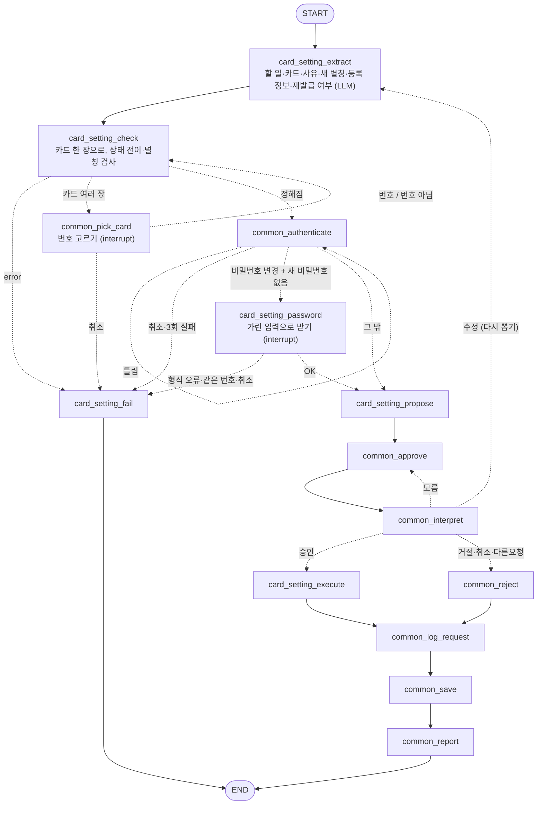
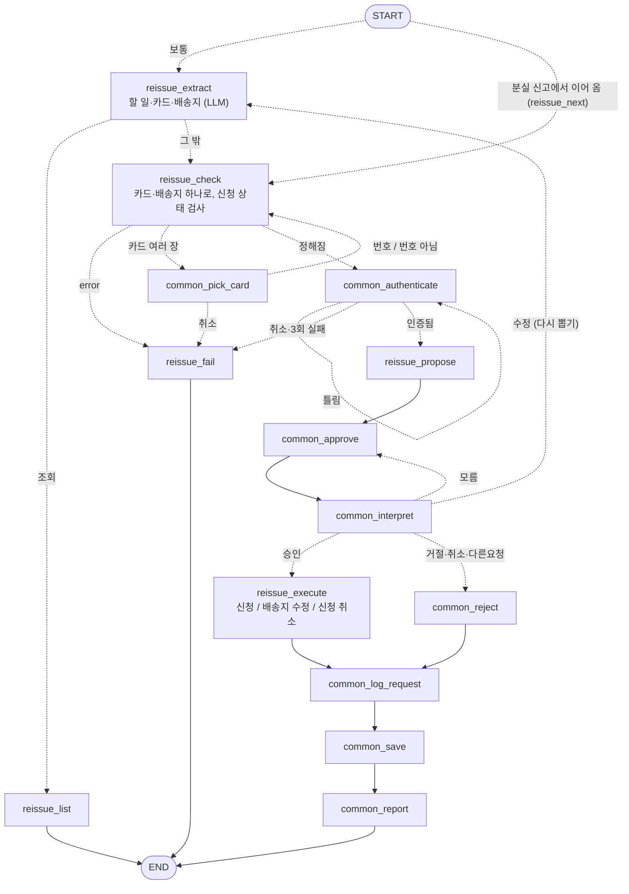
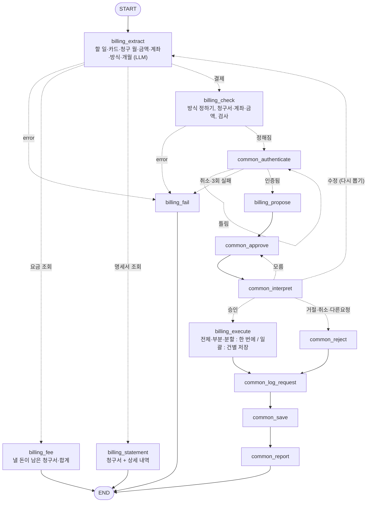

# 가상 금융 업무 에이전트 — 최종 설계

실제 구현(`src/`)에 맞춰 갱신한 설계 자료입니다.
그래프 그림은 코드의 그래프(`get_graph()`)에서 뽑은 연결을 기준으로, 분기 함수(`route_*`)의 조건을 화살표에 적었습니다.

| 문서 | 내용 |
|---|---|
| [설계 초안/](../설계%20초안/) | 코딩 전에 직접 쓴 초안 ([기획서_수기(초안).txt](../설계%20초안/기획서_수기(초안).txt)) 과 손그림·drawio |
| [설계 중/](../설계%20중/) · [기획서.md](../기획서.md) | 초안을 검토·보완한 설계와 그림 (구현하면서 계속 고친 판) |
| **이 문서** | 구현을 마친 뒤의 최종 구조, 그래프별 노드 연결, 분기 조건, State, 변경 내용과 이유 |
| [기획서_수기(최종).txt](기획서_수기(최종).txt) | 이 문서의 텍스트판 (초안·설계 중 txt 와 같은 형식) |
| [그래프/](그래프/) | 그래프 그림. `.mmd`(mermaid 원본, 고칠 때) + `.png`(사진) |

---

## 1. 전체 구조

```
src/
├── main.py              입력 루프, 분기 0(멈춘 업무 판정), 대화 기억, 재시작 복구, 30초 스케줄러
├── state.py             모든 그래프가 같이 쓰는 BankState, new_request()
├── model.py             LLM (gemini) 한 곳에서 생성
├── data_store.py        data.json 읽기·저장 (원자적 저장, 원본 보호)
├── logger.py            턴 단위 실행 로그 (logs/날짜.log)
├── functions/           계산만 : 조회·검사·금액 계산·데이터 변경 (저장은 안 함)
│   ├── common.py          사용자·기준일·본인 확인(해시)·기간·처리 기록·ID·시각
│   ├── account.py         계좌·거래 내역·계좌 설정·등록 계좌
│   ├── transfer.py        이체·조건부·나눠·예약 이체, 예약 실행(run_due_schedules)
│   ├── card.py            카드 조회·상태·별칭·비밀번호·등록·이용 내역·멤버십
│   ├── reissue.py         재발급 신청·수정·취소
│   └── billing.py         청구서·결제·분할 회차
└── agents/              흐름만 : 노드와 그래프
    ├── supervisor/        1단  rewrite → supervisor → 계좌 / 카드 / 결과 / 없음
    ├── account/           2단  계좌 : 조회 · 거래내역 · 이체 · 설정
    │   ├── transfer/        3단  이체
    │   └── setting/         3단  계좌 설정 (별명·용도, 등록 계좌, 예약 조회·취소)
    ├── card/              2단  카드 : 조회 · 설정 · 재발급 · 결제
    │   ├── setting/         3단  카드 설정 (분실·잠금·해제·해지, 별칭, 비밀번호, 등록)
    │   ├── reissue/         3단  재발급
    │   └── billing/         3단  카드 요금 (조회·명세서·전체·부분·분할·일괄)
    ├── result/            후속 결과 조회 ("아까 이체 됐어?")
    └── common/            공통 노드 (인증, 승인, 응답 해석, 거절, 기록, 저장, 안내, 카드 고르기)
```

각 에이전트 폴더는 `graph.py`(노드 연결) / `nodes.py`(노드 함수) / `prompts.py`(LLM 프롬프트) 세 파일입니다.
3단 그래프는 compile 한 뒤 2단 그래프의 **노드로** 넣고, 2단 그래프는 1단 그래프의 노드로 넣습니다.
checkpointer(`InMemorySaver`)는 맨 바깥 `bank_graph` 에만 두고 안쪽 그래프가 물려받습니다.

| 층 | 고르는 것 | 선택지 |
|---|---|---|
| 1단 supervisor | 분야 | 계좌 / 카드 / 결과 / 없음 |
| 2단 account_router | 계좌 업무 | 조회 / 거래내역 / 이체 / 설정 / (카드 업무 = 반송) |
| 2단 card_router | 카드 업무 | 조회 / 설정 / 재발급 / 결제 / (계좌 업무 = 반송) |
| 3단 extract 노드 | 할 일과 필요한 값 | 업무마다 (이체 : 금액·남길 금액·나눠·예약 시각 …) |

**역할 나누기 (원칙 6·7)** — 노드는 "무엇을 부르고 결과를 State 에 넣고 어디로 갈지" 만 정합니다.
금액·잔액·성공 여부는 `functions/` 가 계산한 값을 그대로 보여 주고, LLM 은 **말에서 값을 뽑는 일과 분류만** 합니다.
`functions/` 의 변경 함수는 `data` 안에서만 바꾸고 저장하지 않습니다. 저장은 `common_save` 한 곳에서 합니다.

---

## 2. 실행 흐름 (입력 한 번)



사진 : [그래프/00_실행_흐름.png](그래프/00_실행_흐름.png)

`main.py` 는 입력마다 위를 한 번 돕니다. 처리 전에는 시각이 지난 예약 이체·분할 회차를 먼저 실행합니다(`run_schedules`).
켜 있는 동안은 스케줄러 스레드가 30초마다 같은 확인을 하고, 결과는 `outbox` 에 모았다가 다음 입력 때 보여 줍니다.

### 변경 업무의 공통 흐름 (3단 그래프)

```
extract(LLM 으로 값 뽑기)
  → check(Python 으로 대상 찾기·검사)
       ├ 사유 있음(error)       → fail → 안내하고 끝          [실패]
       ├ 후보 여러 개            → confirm / pick_card(번호 고르기, interrupt) → check
       ├ 빠진 값                 → ask(질문, interrupt) → extract
       └ 다 모임                 → common_authenticate(본인 확인, 세션 1회, interrupt)
                                    → propose(처리안, 계산만)
                                    → common_approve(interrupt 한 줄만)
                                    → common_interpret(LLM : 승인/거절/취소/수정/다른요청/모름)
                                         ├ 승인   → execute(실행 직전 재검사 + data 변경)   [변경]
                                         ├ 거절·취소·다른요청 → common_reject                [거절]
                                         ├ 수정   → revise / extract → check → … 처리안 다시
                                         └ 모름   → common_approve (다시 묻기)
                                    → common_log_request(처리 기록) → common_save(저장, 3회까지)
                                    → common_report(저장 실패면 실패 안내)                 [실패]
읽기만 하는 조회는 extract 다음 바로 query / list 노드에서 답하고 끝납니다.                  [조회]
```

### 조회·변경·승인·거절·실패가 갈리는 곳

| 분기 | 조건 | 어디서 |
|---|---|---|
| 조회 | 할 일이 읽기(조회·거래내역·목록·요금 조회·명세서) | 2단 router, 3단 `route_after_extract` |
| 변경 | 할 일이 쓰기 → 인증·처리안·승인을 거침 | 3단 `route_after_check` → `common_authenticate` |
| 승인 | `common_interpret` 가 "승인" → execute | `route_after_interpret` |
| 거절 | "거절" / "취소" / "다른요청" → `common_reject`. 저장은 하지 않고 처리 기록(거절)만 남김 | `route_after_interpret` |
| 실패 | ① check 의 사유(잔액 부족, 없는 계좌, 상태 전이 불가 …) ② 질문·고르기·본인 확인 취소, 본인 확인 3회 실패 ③ 실행 직전 재검사 실패 ④ 저장 3회 실패 | `*_fail`, `common_report` |

---

## 3. 그래프별 노드 연결

실선은 항상 가는 연결, 점선은 조건 분기입니다. `[[ ]]` 는 안쪽 그래프(서브그래프)를 노드로 넣은 것입니다.

### 3.1 1단 — `bank_graph` (agents/supervisor/graph.py)



사진 : [그래프/01_1단_supervisor.png](그래프/01_1단_supervisor.png)

- 반송은 한 번까지 (`bounced`). 두 번째도 "내 분야 아님" 이면 오가지 않고 안내로 끝냅니다.
- `rewrite` 는 새 요청일 때만 지납니다. 승인·질문의 답은 멈춘 노드에서 이어가므로 여기를 지나지 않습니다.

### 3.2 2단 — 계좌 `account_graph` (agents/account/graph.py)



사진 : [그래프/02_2단_계좌.png](그래프/02_2단_계좌.png)

### 3.3 3단 — 이체 `transfer_graph` (agents/account/transfer/graph.py)



사진 : [그래프/03_3단_이체.png](그래프/03_3단_이체.png)

| 분기 함수 | 조건 → 다음 |
|---|---|
| `route_after_check` | `error` → fail / `candidates` → confirm / 출금 계좌나 `targets` 없음 → ask / 그 밖 → authenticate |
| `route_after_confirm` | `error`(취소) → fail / 그 밖 → check (번호가 아니면 `pick_warning` 을 붙여 다시 묻기) |
| `route_after_ask` | `error`(취소) → fail / 그 밖 → extract (답을 새 query 로). 답이 다른 요청이면 extract 가 `other_request` 로 알아채 error → check → fail |
| `route_after_authenticate` | `error` → fail / `authenticated` → propose / 그 밖 → authenticate |
| `route_after_interpret` | 승인 → execute / 거절·취소·다른요청 → reject / 수정 → revise / 모름 → approve |

이체 유형은 따로 분류하지 않고 뽑은 값으로 정해집니다 : `keep_amount` 가 있으면 조건부, `splits` 가 2줄 이상이면 나눠, `scheduled_at` 이 있으면 예약.

### 3.4 3단 — 계좌 설정 `setting_graph` (agents/account/setting/graph.py)



사진 : [그래프/04_3단_계좌설정.png](그래프/04_3단_계좌설정.png)

할 일 : 변경(별명·용도) / 등록 / 삭제(등록 계좌) / 조회(등록 계좌) / 예약조회 / 예약취소.

### 3.5 2단 — 카드 `card_graph` (agents/card/graph.py)



사진 : [그래프/05_2단_카드.png](그래프/05_2단_카드.png)

정지 후 재발급(4-7) : 카드 설정 그래프에서 분실 신고를 승인·저장한 뒤, `card_to_reissue` 가 할 일을 "신청" 으로 바꾸고 처리안·승인 값을 비워 재발급 그래프로 넘깁니다. 승인은 두 번 따로 받고, 두 번째를 거절하거나 실패해도 앞의 분실 신고는 되돌리지 않습니다.

### 3.6 3단 — 카드 설정 `card_setting_graph` (agents/card/setting/graph.py)



사진 : [그래프/06_3단_카드설정.png](그래프/06_3단_카드설정.png)

할 일 : 분실 신고 / 일시 잠금 / 잠금 해제 / 해지 / 별칭 변경 / 비밀번호 변경 / 등록. 새 비밀번호는 LLM 을 거치지 않고 `secret` interrupt 로 받습니다.

### 3.7 3단 — 재발급 `reissue_graph` (agents/card/reissue/graph.py)



사진 : [그래프/07_3단_재발급.png](그래프/07_3단_재발급.png)

### 3.8 3단 — 카드 요금 `billing_graph` (agents/card/billing/graph.py)



사진 : [그래프/08_3단_카드요금.png](그래프/08_3단_카드요금.png)

방식을 말하지 않으면 : 개월 수가 있으면 분할, 금액이 있으면 부분, 둘 다 없으면 전체.
일괄은 건마다 내고 바로 저장합니다(앞 건은 유지). 나눠 이체(전부 아니면 전무)와 반대입니다.

---

## 4. State 필드와 변경 시점

State 는 하나(`BankState`)를 모든 그래프가 같이 씁니다. 새 요청이면 `new_request()` 가 이번 업무 칸을 모두 비우고,
**`last_transfer`, `authenticated` 만 남깁니다**(맥락·세션 인증).

| 묶음 | 필드 | 넣는 노드 (변경 시점) |
|---|---|---|
| 요청 | `query` | `new_request`(입력) → `rewrite`(가리키는 말을 푼 문장) → ask 노드(질문의 답) → `common_approve`(승인 질문의 답) |
| | `request_text` | `new_request`, `rewrite`. 재시작 복구 때 이 문장으로 다시 돌림 |
| | `history` | `new_request` (main 이 최근 5턴을 넣음) |
| 분류 | `domain` / `reason` | `supervisor`, `bounce`(domain 을 반대쪽으로) |
| | `task` | `account_router` / `card_router`, `bounce`(비움) |
| | `bounced` | `bounce` (반송 1회 표시) |
| 이체 | `from_name` `to_name` `amount` `keep_amount` `splits` `scheduled_at` | `transfer_extract`(비어 있는 칸만), `transfer_revise`(바뀐 칸) |
| | `from_account` `to_account` `targets` `split_index` | `transfer_check`(이름 → ID, 보낼 목록), `transfer_confirm`(고른 ID), `transfer_revise`(이름이 바뀌면 ID 비움) |
| 설정 | `setting_action` `target_name` `setting_field` `new_value` `reg_info` | 설정·카드 설정·재발급의 extract 노드 |
| | `target_account` | check 노드(찾은 ID), `setting_confirm`(고른 ID) |
| 카드 | `card_filter` | `card_extract` |
| | `address_id` | `reissue_check` |
| | `reissue_next` `reissue_address` | `card_setting_extract`(분실 신고 + 재발급 요청), `card_to_reissue` 가 읽음 |
| 요금 | `billing_info` | `billing_extract`(말한 값), `billing_check`(방식·결제 대상 `targets`) |
| 되묻기 | `candidates` `confirm_for` | check 노드가 넣고, 고르기 노드·다음 check 가 비움 |
| | `pick_warning` | 고르기 노드(번호가 아닌 답), 번호를 고르면 비움 |
| | `question` | `transfer_ask`(무엇을 물었는지), `setting_check`(물을 질문) |
| | `error` | check · extract · 고르기 · 질문 · 인증 노드 (있으면 fail 로) |
| 승인 | `proposal` / `approval` | propose(처리안, 대기) → `common_interpret`(승인/거절/…) |
| 마무리 | `new_data` | execute(바꾼 데이터) → `common_log_request`(기록 덧붙임) → `common_save`(저장 후 비움) |
| | `result` | execute(완료) / `common_reject`(거절) / `common_save`(실패) |
| 인증 | `auth_tries` | `common_authenticate` (틀린 횟수) |
| 유지 | `authenticated` | `common_authenticate` 성공. 세션 동안 유지 |
| | `last_transfer` | `transfer_execute`. 다음 이체 요청의 맥락 |

State 에 없는 것 : 최근 대화(`history` 원본)는 `main.py` 가 들고 있고, 진행 중 업무는 `data.json` 의 `pending`, 처리 기록은 `requests` 에 둡니다.
체크포인터는 메모리라 끄면 사라지므로, 끈 뒤에도 남아야 하는 것은 파일에 둡니다.

---

## 5. 공통 노드 (agents/common/nodes.py)

| 노드·함수 | 하는 일 |
|---|---|
| `common_pending_check` | [분기 0] 멈춘 업무의 종류 (approval / question / secret / 없음). main 이 부름 |
| `common_pick_card` | 이름에 맞는 카드가 여러 장이면 번호로 고르게 함 (카드 설정·재발급) |
| `common_authenticate` | 본인 확인. 세션 동안 1회, 3회 틀리면 중단. 처리안 **전**에 받음 |
| `common_approve` | 처리안을 보여주고 interrupt. **다른 일은 하지 않음** (재개하면 노드가 처음부터 다시 돌기 때문) |
| `common_interpret` | 승인 질문의 답을 승인 / 거절 / 취소 / 수정 / 다른요청 / 모름 중 하나로 (LLM) |
| `common_reject` | 거절·취소 안내 (정지 후 재발급의 2번째 거절은 "분실 신고는 저장됨" 안내) |
| `common_log_request` | 처리 기록 한 줄을 저장할 데이터에 덧붙임 (`functions.add_request`) |
| `common_save` | 저장. 실패하면 3회까지. 진행 중 업무(`pending`)도 같은 저장에서 지움 |
| `common_report` | 저장이 실패했을 때만 실패 안내로 바꿈 (저장과 안내를 나눈 이유 : 실패했는데 "완료" 를 말하지 않게) |
| `is_cancel` / `picked` / `pick_text` / `pick_warning` | 질문 답의 취소 판정, 번호 판정, 번호가 아닐 때 "현재 'OO' 업무 중입니다 …" 안내 |

---

## 6. 데이터 (data/initial_data.json → data.json)

`initial_data.json` 은 읽기만 하고, 모든 변경은 작업본 `data.json` 에만 씁니다 (`data_store`, 임시 파일에 쓴 뒤 이름만 바꾸는 원자적 저장).

| 키 | 필드 | 비고 |
|---|---|---|
| `users` | owner_id, name, phone, ssn_tail, pin | 본인 확인. pin·ssn_tail 은 해시 |
| `accounts` | account_id, owner_id, nickname, purpose, balance, bank_code, bank_name, account_number, account_password | account_password 는 해시 |
| `registered_accounts` | registered_id, owner_id, bank_name, account_number, holder_name, nickname, account_id | 상대 계좌 주소록. 가상은행이면 account_id 로 이어짐 |
| `cards` | card_id, owner_id, name, account_id, status, card_number, card_type, bank_code, bank_name, card_password, credit_limit, report_reason, reported_at | status : active / locked / lost / cancelled |
| `transactions` | transaction_id, owner_id, account_id, type, amount, occurred_at, card_id, merchant | 계좌 입출금 (체크카드 결제 포함) |
| `card_usages` | usage_id, owner_id, card_id, amount, occurred_at, merchant | 신용카드 이용 내역 |
| `card_statements` | statement_id, card_id, owner_id, billing_month, total_amount, paid_amount, remaining_amount, due_date, status, items, paid_at, paid_account | status : unpaid / partial / paid |
| `card_installments` | installment_id, statement_id, card_id, total_amount, months, paid_count, monthly_amount, next_due_at, status | 분할 계획. next_due_at 이 지나면 자동 납부 |
| `scheduled_transfers` | schedule_id, owner_id, from_account, to_account, amount, scheduled_at, status | 예약 → 완료 / 실패 / 취소 |
| `memberships` | membership_id, owner_id, card_id, name, grade, points | |
| `addresses` | address_id, owner_id, label, address | 집 / 회사 |
| `reissue_applications` | application_id, owner_id, card_id, address_id, status, created_at | received / making / shipping / cancelled |
| `requests` | request_id, owner_id, task_type, content, status, created_at | 처리 기록(원장). 후속 결과 조회가 여기서 찾음 |
| `pending` | request_text, task, kind, created_at | 진행 중 업무 한 건 (재시작 복구) |
| `bills` | (제공 데이터) | 청구서 카테고리를 카드 요금으로 옮겨 쓰지 않음 |

---

## 7. 초안에서 바뀐 내용과 이유

### 7.1 초안 → 설계 중 (구현 전 검토)

자세한 원문 대조는 [설계 중/기획서_수기(진행).txt](../설계%20중/기획서_수기(진행).txt), 요약은 [기획서.md 10장](../기획서.md#10-초안에서-바뀐-것) 에 있습니다.

| # | 바꾼 것 | 이유 |
|---|---|---|
| 1 | 분기 조건 / 처리 규칙 / 상태 전이 섹션 신설 | 기능 목록만으로는 "언제 실패하고 언제 되돌아가는지" 를 적을 자리가 없었다 |
| 2 | HITL 기준을 "민감정보·돈" → "파일을 바꾸는가" | 카드 분실 정지는 돈이 안 움직이고 별명 변경은 민감정보가 아니지만 둘 다 승인 대상. 기계적으로 갈리는 기준 |
| 3 | 승인 대기 판정(분기 0)을 맨 앞에 | 없으면 "응, 진행해" 가 새 요청으로 분류된다 |
| 4 | 승인을 부작용 없는 단독 노드로 (propose / approve / execute) | interrupt 에서 재개하면 노드를 처음부터 다시 실행해 저장이 두 번 된다 |
| 5 | 서브그래프를 tool 이 아니라 노드로 | tool 로 감싸면 재실행 범위가 tool 전체로 커진다 |
| 6 | 필요 정보 확인을 2단 → 3단 | 2단 시점에는 유형을 몰라 무엇이 부족한지 판단할 수 없다 |
| 7 | 도메인 반송 경로 | 1단이 잘못 보내면 복구할 길이 없었다 |
| 8 | 흐름에 되돌아오는 경로(질문·수정·거절) | 성공하는 경우만 한 방향으로 그려져 있었다 |
| 9 | 카드 에이전트 2개 → 4개 (조회·설정·재발급·결제) | 2개면 3단 선택지가 9개·7개가 되어 층을 나눈 목적과 반대 |
| 10 | 카드 상태·재발급 상태 정의 | "분실 정지는 해제 불가" 같은 분기를 적으려면 상태가 먼저 있어야 한다 |
| 11 | 마지막 "LLM 최종 검토 후 출력" 제거 | 금액·성공 여부를 LLM 이 다시 쓰면 틀릴 수 있다. Python 이 낸 값을 그대로 보여준다 |
| 12 | 설계 순서를 기능 단위 관통으로 | 원래 순서는 마지막 통합 전까지 끝까지 도는 업무가 하나도 없었다 |
| 13 | 데이터 구조 확장 (은행명·용도·비밀번호·신용카드·청구서·예약 …) | 기능을 정한 뒤 그 기능이 쓸 필드를 정했다 |

### 7.2 설계 중 → 최종 구현

설계 중에 계획한 것과 실제로 만들면서 달라진 것입니다.

| # | 설계 중 | 최종 | 이유 |
|---|---|---|---|
| 1 | 공통 노드 17개 (맥락 확인, 대상 해소, 부족 정보 질문, 처리안, 수정, 재검증, 오류, 재분류, 이력 조회, 다음 업무 …) | 공통 노드는 인증·승인·해석·거절·기록·저장·안내·카드 고르기 8개. 나머지는 업무별 노드(extract / check / confirm / ask / propose / revise / execute / fail)와 `functions/` 로 | 무엇이 부족한지, 무엇을 물을지, 처리안에 무엇을 보일지가 업무마다 달라서 공통으로 두면 안에서 업무별로 또 갈라야 했다. 똑같이 거치는 단계만 공통으로 남겼다 |
| 2 | 대상 해소 `common_resolve_target` | `functions.find_accounts / find_targets / find_cards …` + 로그 `resolve` | 이름 → ID 는 계산이라 원칙 7 에 따라 functions 로 |
| 3 | 3단 `transfer_router` 가 이체 유형(즉시·조건부·나눔) 분류 | 분류 노드 없이 `transfer_extract` 가 값(남길 금액·나눠 목록·예약 시각)을 뽑고, 값이 있는지로 유형이 정해짐 | 한 요청이 여러 축(조건부 + 예약 등)을 같이 가져 하나로 분류할 수 없었고, LLM 호출도 한 번 줄었다 |
| 4 | 재검증 `common_revalidate` 노드 | `transfer_all` / `pay_statement` 앞의 재검사, 일괄 결제는 건마다 `check_payment` | 재검증은 실행과 같은 데이터로 바로 앞에서 해야 사이에 바뀔 틈이 없다 |
| 5 | 1단 선택지 계좌 / 카드 | 계좌 / 카드 / **결과** / **없음** + 앞단 **rewrite** | 후속 결과 조회("아까 이체 됐어?")는 계좌·카드 어느 쪽 업무도 아니고, 은행 업무가 아닌 말은 안내로 끝내야 했다. "그 카드" 는 1단이 분류하기 전에 풀어야 분류도 맞는다 |
| 6 | 맥락 확인 `common_check_context` | `main.py` 가 최근 5턴 {요청, 답 앞 4줄} 을 들고, `rewrite` 노드가 가리키는 말만 이름으로 바꿈 | 뒤의 노드들이 대화 기록을 몰라도 되게, 문장 하나만 바꿔 넘기는 방식이 가장 단순했다 |
| 7 | 이력 조회 `common_query_history` | `agents/result` + `functions.find_requests` (처리 기록 원장에서 업무·기간·대상으로 거름) | 답의 출처를 LLM 기억이 아니라 파일에 남은 기록으로 (원칙 6). 체크포인터는 끄면 사라진다 |
| 8 | 재분류 `common_reroute` | 1단의 `bounce` / `bounce_fail` (2단이 "내 분야 아님" 을 고르면 1회 반송) | 분야가 둘이라 LLM 을 다시 부르지 않고 반대쪽으로 바로 넘기면 된다 |
| 9 | 다음 업무 `common_next_task` | `card_to_reissue` 노드 (분실 신고 → 재발급만) | 이어서 처리하는 업무가 정지 후 재발급 하나뿐이었다 |
| 10 | 조회도 3단 에이전트 (AccountQueryAgent, CardQueryAgent) | 2단 안의 노드 (`account_query`, `account_history`, `card_extract` → `card_query`) | 읽기는 인증·승인·저장이 없어 노드 한두 개로 끝난다. 층을 늘릴 이유가 없었다 |
| 11 | 예약 이체 : 입력할 때·켤 때 확인 | + 30초 스케줄러 스레드, `work_lock`(파일 동시 저장 방지), `outbox`(치던 줄에 끼어들지 않게) | 입력이 없으면 시각이 지나도 실행되지 않았다 |
| 12 | 예약 : 조건부·나눠도 예약 | 금액을 정한 한 곳 이체만 예약 | 조건부는 실행할 때 잔액으로 금액이 정해져 승인한 금액과 달라진다. 나눠는 한 곳씩 따로 예약하면 된다 |
| 13 | 비밀번호 : 검증 후 즉시 폐기 | data.json 에 pbkdf2 해시(salt, 10만 번)로 저장·비교, 입력은 `getpass`, 로그는 `****` | 평문으로 파일에 있었다. 4자리 숫자는 해시만 하면 금방 풀려 salt 와 반복을 붙였다 |
| 14 | 재시작 복구 : 진행 중 업무를 이어서 처리 | 멈춘 업무를 `data.json` 의 `pending` 에 적고, 켤 때 알려 준 뒤 원래 요청 문장으로 **처음부터** 다시 (승인도 다시) | 이전 승인으로 자동 실행하지 않는다. 꺼진 동안 잔액·카드 상태가 바뀌었을 수 있다 |
| 15 | 질문·번호 고르기 중 다른 요청 | 질문 답은 extract 의 `other_request` 로 알아채 멈춤. 번호 고르기는 LLM 없이 "현재 'OO' 업무 중입니다. '취소' 후 다시" 안내 (`pick_warning`) | 번호 질문에 다른 말을 치면 같은 질문만 반복됐다. 번호 고르기는 LLM 을 부르지 않는 편이 확실했다 |
| 16 | 카드 이름 : 글자가 들어 있으면 후보 | 정확히 같은 이름을 먼저, 없을 때만 포함 검색. 설정·재발급은 여러 장이면 `common_pick_card` | "생활비 카드" 에 "생활비 신용카드" 까지 걸려 엉뚱한 카드를 바꿀 수 있었다 |
| 17 | 카드 조회 : 은행별 | 은행 여러 곳을 목록으로, "OO은행 말고" 는 `exclude_banks` 로 빼고 은행별로 나눠 보여줌 | "다른 은행 카드는?" 이 전체를 보여줬다 |
| 18 | 분할 결제 : 회차 생성 | 첫 회차는 지금, 남은 회차는 `next_due_at` 이 지나면 스케줄러가 자동 납부 (잔액 부족이면 하루 뒤 재시도). 분할 중 부분 결제는 막음 | 회차만 만들고 내는 기능이 없었다. 분할 중 일부만 내면 회차 금액과 남은 금액이 맞지 않게 된다 |
| 19 | 등록 계좌 : 등록·조회·삭제 | 이체 입금 대상에도 포함 (`reg-` ID). 가상은행이면 입금, 다른 은행이면 출금만 | 등록해 놓고 그 계좌로 보낼 수 없었다 |
| 20 | 로그 : 모든 턴을 펼침 | 잘 끝난 턴은 한 줄 요약, 실패·예외 턴만 펼침. 스케줄러는 실행한 게 있을 때만 | 로그가 너무 길어 문제 턴을 찾기 어려웠다 |
| 21 | 처리 기록 `requests` : target, result 필드 | task_type, content(처리안 표 그대로), status | 처리안 표를 그대로 남기면 후속 조회 때 사용자가 본 내용과 같다 |
| 22 | 파일 구조 : `graph.py` / `functions.py` 하나씩 | `agents/` 층별 폴더, `functions/` 업무별 파일 | 이체 노드가 350줄, functions.py 가 700줄까지 늘었다 |
| 23 | LangSmith 로 LLM 호출 추적 | 파일 로그만 사용, 의존성에서 뺌 | 필요한 추적(분류 결과·근거)은 로그의 route 줄로 충분했다 |

### 7.3 이번에 하지 않은 것 (결정)

| 항목 | 결정과 이유 |
|---|---|
| 재시작 복구에서 첫 문장 뒤의 답까지 복원 | 첫 문장으로만 다시 돌린다. 재시작 후에는 처음부터 다시 말하는 경우가 많고, 다시 묻더라도 틀리게 처리하지 않는다 |
| 카드 사용(가맹점 결제) | 범위 밖. 잠금·분실 카드는 "사용할 수 없습니다" 안내만 |
| 청구서(`bills`) 카테고리 | 카드 결제와 흐름이 같아 제외. 부분·일괄 결제는 카드 요금으로 옮김 |
| 장기 기억(자주 쓰는 배송지·계좌) | 대화 기억은 세션 동안만. 장기 기억은 LangGraph Store 로 보완할 점 |
| 하위 그래프 5개의 같은 모양 분기 함수 합치기 | 합치면 함수를 만드는 함수가 필요해 오히려 읽기 어렵다 |
| 긴 함수 나누기 (`setting_check_node` 82줄) | 동작·테스트·주석이 되어 있어 마무리 단계에서는 둔다. 기능을 더 붙일 때 할 일별로 나눔 |
